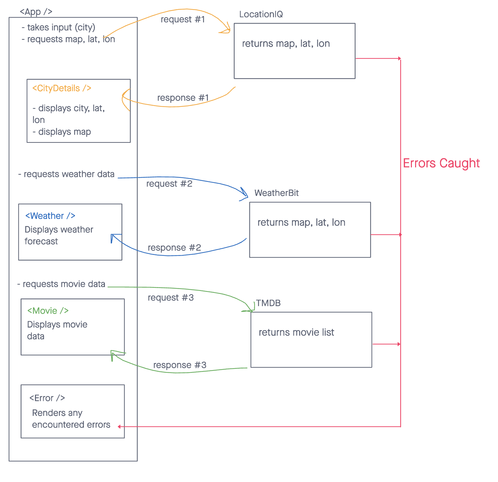
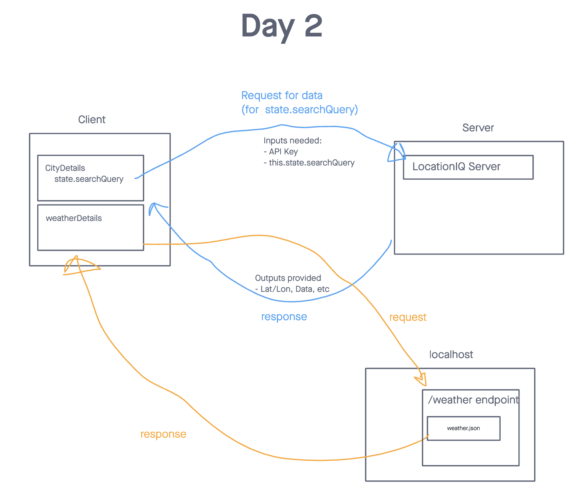
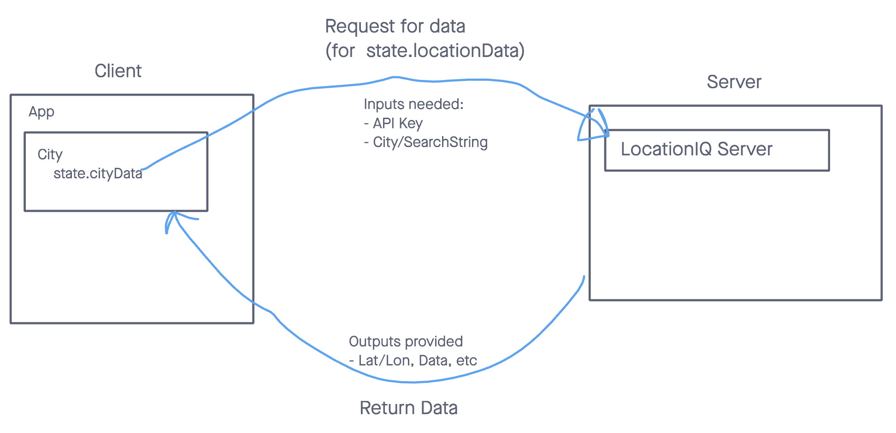

# City Explorer

[Check out the online version](https://q-city-explorer.netlify.app)

**Author**: Paul Brown
**Version**: 1.0.0

## Overview
Lets a user find out more information about a city

## Architecture
### Day 8

### Day 7

### Day 6

[Whiteboard Link](https://projects.invisionapp.com/freehand/document/Kv8Eoqf3X)

## Time Logs

### Wed 23rd
Name of feature: Build Node Express serve with /weather API
Estimate of time needed to complete: 2 hours
Start time: 14:00
Finish time: 
Actual time needed to complete: 

### Tuesday 22nd
Name of feature: Build Node Express serve with /weather API
Estimate of time needed to complete: 2 hours
Start time: 13:30
Finish time: 16:30
Actual time needed to complete: 3hrs

### Monday 21st
Name of feature: Build app scaffold and API connect to Location IQ
Estimate of time needed to complete: 2 hours
Start time: 13:00
Finish time: 16:00
Actual time needed to complete: 3hrs

## Getting Started
<!-- What are the steps that a user must take in order to build this app on their own machine and get it running? -->
First install Node
`npm install`

Then run the app
`npm run`

## Change Log
<!-- Use this area to document the iterative changes made to your application as each feature is successfully implemented. Use time stamps. Here's an example:

01-01-2001 4:59pm - Application now has a fully-functional express server, with a GET route for the location resource. -->

## Credit and Collaborations

All the AI's out there 👊